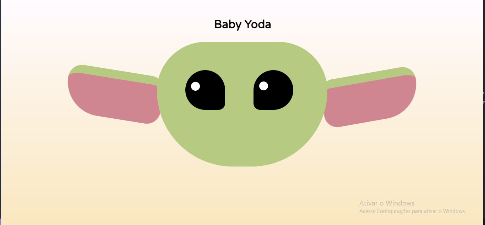

# Sobre o projeto
É uma pequena animação do personagem baby yoda, onde o personagem mexe as orelhinhas. O projeto é baseado em um vídeo do Youtube, do canal "LeehXD".
[Assista ao video](https://youtu.be/73B40rMoHks?si=0rtSImMaQKzcEMOT)

# Tenologias e Ferramentas para construção do Projeto

* HTML
* CSS
* Visual Studio Code (VS Code)

#Resultado

   

